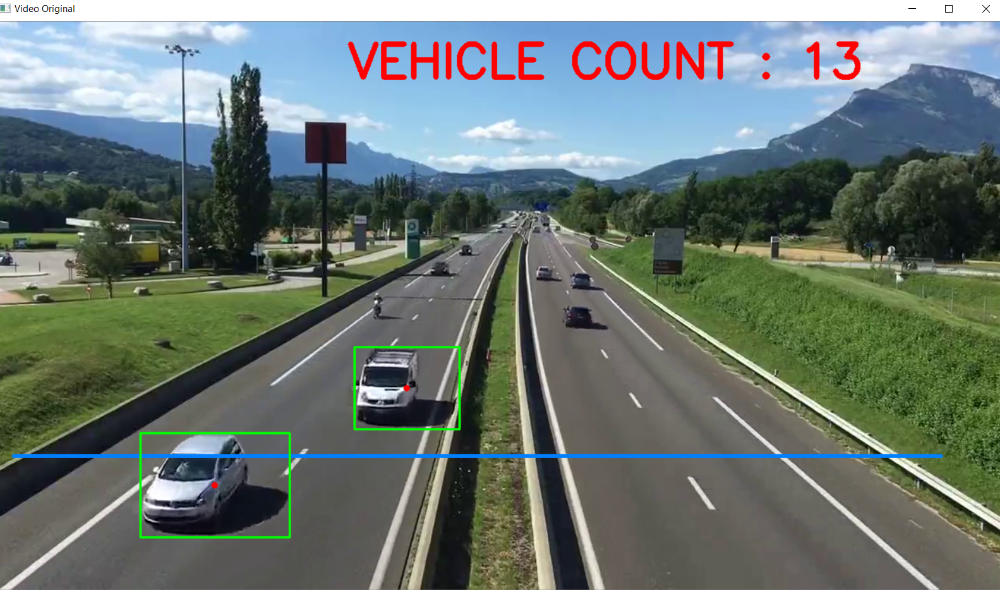

# vehicle-counter--image-processing<br>
### Project Description
-> vehicle-counter is an image-processing based project made using made using python, OpenCV.<br>
-> This project counts vehicle passing through a particular location.
-> It automatically detects the vehicles (by marking it with a green rectangle and a red point at the centre) and counts while passing through a particular location. 

-> I have given sample.mp4 along with it to display a sample output of how the code runs.<br>


### Tools and Languages:


<br>

### Installing Libraries

```cmd
pip install numpy
pip install opencv
pip install times

```

-> We will use numpy library because it contains a multi-dimensional array and matrix data structures. It can be utilised to perform a number of mathematical operations on arrays such as trigonometric, statistical, and algebraic routines.
-> We use OpenCV library because it is a cross-platform library using which we can develop real-time computer vision applications. It mainly focuses on image processing, video capture and analysis including features like face detection and object detection


### Steps to follow
-Install the given libraries<br>
-Download the code from the given github repository<br>
-Run the code<br><br>

-> After running the code the output will look like the following : <br>

### Output


### Developed by:
<a href="https://github.com/sambit221">Sambit Kumar Tripathy</a>
